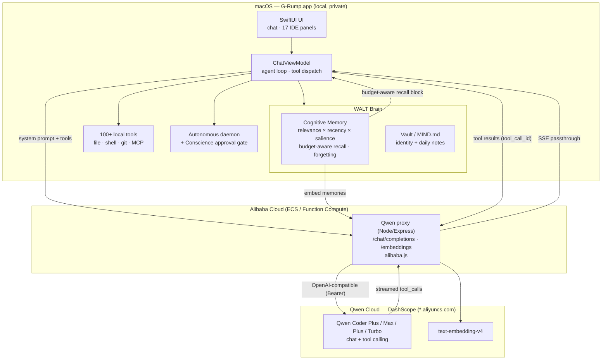

# G-Rump on Qwen — Architecture

G-Rump is a native macOS autonomous coding agent whose reasoning, tool-use, and
memory all run on **Qwen via Alibaba Cloud (Qwen Cloud / DashScope)**. Capture and
storage stay local for privacy; cognition runs in the cloud — a hybrid edge-cloud
design. The headline feature is a **persistent cognitive memory** (Track 1).

## System diagram

## The agent loop (Qwen tool calling)

1. `ChatViewModel` assembles the system prompt: identity (MIND.md) + project
   context + **budget-aware memory recall** (the most relevant/recent/important
   memories packed into a fixed token window).
2. The request (messages + 100+ tool definitions, OpenAI tool schema) is sent to
   the Alibaba-hosted proxy, which forwards to Qwen on DashScope.
3. Qwen streams `tool_calls`; G-Rump executes the tool locally (behind the
   Conscience gate for mutating tools) and sends results back with
   `tool_call_id` — the multi-turn loop that powers autonomous coding.
4. After the turn, the memory store records a summary; a periodic **consolidation
   pass** decays, merges duplicates, and forgets stale memories.

## Cognitive memory (Track 1: MemoryAgent)

| Rubric requirement | How G-Rump answers it |
|---|---|
| Efficient storage & retrieval | Embedded memories (Qwen `text-embedding-v4`, local NLEmbedding fallback) ranked by cosine relevance |
| Recall within a limited context window | `budgetedRecall` packs the highest-scoring memories into a fixed token budget — relevance × recency × salience, not flat top-K |
| Timely forgetting of outdated info | `consolidate` "sleep" pass: exponential strength decay, near-duplicate merge (reinforce survivor), prune below-floor/overflow |
| Increasingly accurate across sessions | Memory persists across sessions; the daemon's outcomes feed back into salience |

## Proof of Alibaba Cloud

`backend/alibaba.js` is the single place the backend calls Alibaba Cloud — every
model call goes to `*.aliyuncs.com` (DashScope). The deployed `/api/health`
endpoint reports the Alibaba host it targets. See `backend/README-DEPLOY.md`.
